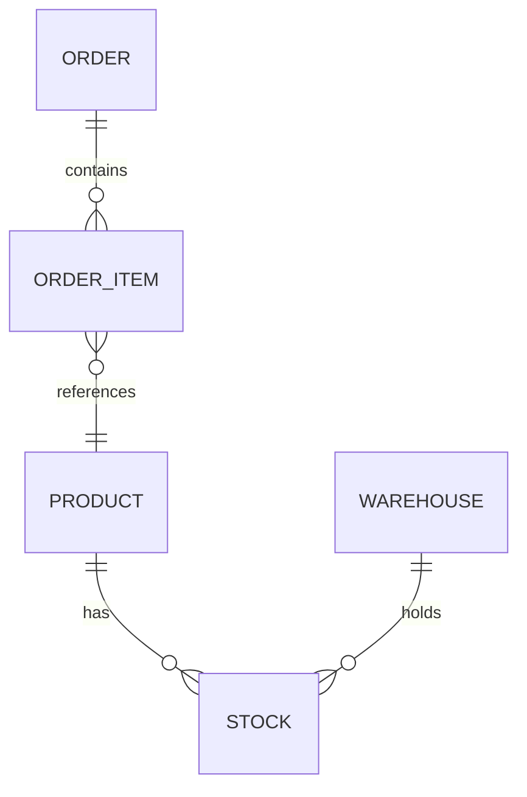

# To-Spec — HICC Data Warehouse Blueprint

Draw the blueprint for a data model before any code is written. This skill takes approved requirements (from `grill` or direct user input) and produces a formal specification document (`spec.md`) for the HICC PET data warehouse.

**Blueprint** is the leading word: the spec is the model's design drawing, reviewed and signed off before construction begins. Every ambiguity resolved here prevents a construction defect downstream.

Output artifact: a single `spec.md` in the repo root or a dedicated specs directory. The spec is the single source of truth for the downstream `to-ticket → implement-hicc-dw` pipeline.

## 1. Business Context & Query Patterns

Before drawing the blueprint, understand who uses the data and how.

1. **Business domain** — which of the 9 HICC domains does this belong to (01_trd / 02_mkt / 03_prd / 04_ful / 05_inv / 06_voc / 07_fnc / 08_scm / 09_mdm)?
2. **Query audience** — who will query this model? (FineBI reports / ad-hoc analysts / operational dashboards / data science)
3. **Query patterns** — what are the top 3 query patterns? (e.g. "daily GMV by channel by country", "monthly avg inventory by warehouse", "SKU-level P&L")
4. **Freshness requirement** — how fresh must the data be? (T+0 real-time / T+1 daily / T+7 weekly / monthly)
5. **Data volume estimate** — approximate row count at current volume and projected 6-month growth. Pull from upstream ods table `INFORMATION_SCHEMA` if available.
6. **Existing models** — check `hicc-dw` `lineage.md` and `architecture.md` for any overlapping models. If the model already exists, this is a **modification spec** — skip to the change log.

**Completion criterion**: business domain, audience, query patterns, and freshness are documented. If the model already exists, confirm with the user whether this is a modification.

## 2. Conceptual Model

Draw the high-level entity relationship. This is the section the business user signs off on.

1. **Entities** — list every business entity involved (Order, Product, Customer, Warehouse, etc.)
2. **Relationships** — describe the cardinalities (Order 1→N OrderItem, Product N→M Warehouse via Stock)
3. **Mermaid ERD** — generate a Mermaid ER diagram for visual review:



4. **Glossary** — define any ambiguous business terms (e.g. "有效订单" = status ≠ CANCELLED, "在库天数" = days since last receipt)

**Completion criterion**: the ERD and glossary are readable by a non-technical stakeholder. If they ask "what does this entity mean?", the blueprint is insufficient — refine it.

## 3. Grain Declaration

Every model in the blueprint must declare its grain in exactly one sentence. If you can't write one sentence, the model is under-defined.

List every model in the spec with its grain:

```yaml
models:
  - name: dwd_trd_toc_order_item_di
    grain: "one row per order_id × line_item_id"
    layer: dwd
    domain: 01_trd
    type: transaction_fact

  - name: dim_product_skus_sales
    grain: "one row per sku_id"
    layer: dim
    domain: 09_mdm
    type: dimension
```

**Completion criterion**: every model in the spec has a one-sentence grain, layer, and domain. No model passes without a grain that matches its model type (fact/dim/aggregate/snapshot).

## 4. Dimensional Model

For each model declared in Section 3, document the dimensional structure.

### 4.1 Facts (for dwd/dws models)

```yaml
dwd_trd_toc_order_item_di:
  measures:
    - name: unit_price_usd
      data_type: DECIMAL(18,4)
      description: "单价，按汇率转为USD"
    - name: quantity
      data_type: INT64
      description: "数量"
  foreign_keys:
    - name: order_id
      references: dim_orders
      description: "订单维度"
    - name: sku_id
      references: dim_product_skus_sales
      description: "商品维度"
    - name: channel_id
      references: dim_channel
      description: "渠道维度"
```

### 4.2 Dimensions (for dim models)

```yaml
dim_product_skus_sales:
  primary_key: sku_id
  scd_strategy: SCD2
  scd_columns: [category_l1, category_l2, category_l3, brand, supplier]
  attributes:
    - name: sku_code
      data_type: STRING
      description: "SKU编码"
    - name: product_name
      data_type: STRING
      description: "商品名称"
    - name: category_l1
      data_type: STRING
      description: "一级类目"
    - name: category_l2
      data_type: STRING
      description: "二级类目"
    - name: brand
      data_type: STRING
      description: "品牌"
```

### 4.3 Hierarchies

Document any drill path:

```yaml
hierarchies:
  - name: channel_geo
    levels: [channel_id, country_code, marketplace_id]
    description: "渠道 → 国家 → 站点"
```

### 4.4 SCD Strategy Declaration

| Strategy | When to Use | Implementation |
|----------|-------------|----------------|
| SCD1 (overwrite) | Business key changes are corrections (e.g. typo fix) | `UPSERT` on matching key |
| SCD2 (add row) | Business key changes need history preserved (e.g. reclassification) | Add new row with `valid_from`/`valid_to`/`is_current` |
| SCD3 (add column) | Only previous value matters | Add `previous_value` column (rare, prefer SCD2) |

HICC convention: use SCD2 for all customer-facing dimensions that change over time (product category reorg, supplier changes). Use SCD1 for corrections-only dimensions.

**Completion criterion**: every model has its fact/dimension structure fully specified. Every dimension declares its SCD strategy. The blueprint is complete enough for a dbt developer to implement without ambiguity.

## 5. Source-to-Target Mapping (STM)

This is the column-level blueprint. Every column in every target model maps to an upstream source.

```yaml
dwd_trd_toc_order_item_di:
  column_mappings:
    - target: order_id
      source: "ods_orders_00.order_id"
      transformation: direct
      data_type: STRING
      cleaning: "TRIM, reject NULL"
    - target: unit_price_usd
      source: "ods_order_items.unit_price, dim_exchange_rates.to_usd_rate"
      transformation: "oi.unit_price / COALESCE(er.to_usd_rate, 1)"
      data_type: DECIMAL(18,4)
      cleaning: "flag negative unit_price for review"
    - target: sku_id
      source: "ods_order_items.sku_code → dim_product_skus_sales.sku_id"
      transformation: "JOIN dim_product_skus_sales ON sku_code"
      data_type: INT64
      cleaning: "unmatched → 0 (UNMAPPED), log warning if >5%"
    - target: event_date_utc
      source: "ods_orders_00.event_time"
      transformation: "DATE(event_time_utc)"
      data_type: DATE
      cleaning: "reject NULL event_time"
```

Transformation types:
- `direct` — pass through as-is
- `lookup` — JOIN to a dimension table
- `computed` — arithmetic or function
- `derived` — CASE WHEN / COALESCE / conditional
- `system` — etl_time, row_hash, etc.

**Completion criterion**: every column in every target model has a row in the STM. The `transformation` field is specific enough to generate SQL from (the `implement-hicc-dw` skill will use this directly). Blueprint the column lineage until no analyst reading the STM would ask "where does this field come from?"

## 6. Metric Definitions

Every aggregated metric (in DWS models and FineBI) must have a complete, unambiguous definition.

```yaml
metrics:
  - name: gmv_usd
    expression: "SUM(oi.unit_price_usd * oi.quantity)"
    model: dws_trd_daily_channel_summary
    aggregation: SUM
    time_filter: event_date_utc
    filters:
      - "order_status NOT IN ('CANCELLED', 'REFUNDED')"
      - "channel_type = 'toc'"
    unit: USD
    data_source: dwd_trd_toc_order_item_di

  - name: avg_inventory_days
    expression: "AVG(DATE_DIFF(CURRENT_DATE(), last_receipt_date, DAY))"
    model: dws_inv_daily_warehouse_summary
    aggregation: AVG
    unit: days
    data_source: dwd_inv_global_detail_v2_snap
    business_rule: "exclude SKUs with 0 stock (zero-stock SKUs distort the average)"
```

Each metric definition covers:
- Formula (exact SQL expression)
- Aggregation type
- Filter conditions
- Unit
- Data source model
- Business rules / edge cases

**Completion criterion**: every metric a stakeholder has asked for has a definition with all 6 fields filled. An analyst can reproduce the number from source data using only this definition. Blueprint the metrics before any aggregation code is written.

## 7. Data Quality & Acceptance Criteria

Declare how the model will be validated before it's considered production-ready.

```yaml
data_quality:
  dwd_trd_toc_order_item_di:
    pre_merge:
      - "Row count vs yesterday: |count - count_yesterday| / count_yesterday < 0.30"
      - "NULL rate on key columns (order_item_key, order_id, sku_id) = 0%"
    post_merge:
      - "Referential integrity: sku_id IN dim_product_skus_sales > 95%"
      - "Date range: event_date_utc = yesterday only"
      - "Uniqueness: order_item_key = 100%"
      - "Metric reasonability: AVG(unit_price_usd) BETWEEN 1 AND 10000"

  dws_trd_daily_channel_summary:
    post_merge:
      - "Row count: |this.count - yesterday.count| / yesterday.count < 0.10"
      - "Metric reconciles to source: SUM(gmv) = SUM(dwd_trd_toc_order_item_di.gmv) WHERE same date/channel"
```

For each check, the acceptance threshold is stated as a pass/fail condition.

**Completion criterion**: every model has at least a post-merge row count check and a key-column NULL check. For DWD models, referential integrity to referenced DIMs is declared. For DWS models, reconciliation to source DWD is specified. The blueprint draws the quality gates before the model is built.

## 8. Physical Design

Declare the BigQuery-specific physical characteristics.

```yaml
physical_design:
  dwd_trd_toc_order_item_di:
    partition:
      field: event_date_utc
      type: DATE
      expiration_days: 365
    cluster:
      - channel_id
      - country_code
      - sku_id
    materialization: table
    incremental_strategy: null (full refresh)

  dwd_inv_global_detail_v2_snap:
    partition:
      field: synctime
      type: DATE
      expiration_days: 365
    cluster:
      - warehouse_code
      - sku_id
    materialization: table
    incremental_strategy: insert_overwrite

  dws_trd_daily_channel_summary:
    partition:
      field: event_date_utc
      type: DATE
      expiration_days: 730
    cluster:
      - channel_id
      - country_code
    materialization: table
    incremental_strategy: null (full refresh, daily)
```

Key rules:
- **Partition**: always on a date/timestamp column. Prefer `_utc` suffixed timestamps.
- **Cluster**: order by cardinality descending. First column = highest cardinality filter.
- **Materialization**: default `table`; `_snap` suffix → `incremental` + `insert_overwrite`; DWS → `table` or `view`.
- **Expiration**: DIM/DWD = 365 days, DWS = 730 days (historical aggregates kept longer).
- **Business fields**: always allow NULL (`INT64`, not `INT64 NOT NULL`).

**Completion criterion**: every model has partition, cluster, materialization, and expiration declared. The design aligns with HICC's BigQuery cost governance rules (avoid full-table scans, prefer clustered partition pruning).

## 9. Delivery Checklist

Before the spec is complete, run this checklist:

```markdown
## Spec Acceptance Checklist

- [ ] Business domain and audience are documented
- [ ] Conceptual model ERD matches business understanding
- [ ] Every model has a one-sentence grain
- [ ] Every fact has its measures and foreign keys listed
- [ ] Every dimension has its primary key, attributes, and SCD strategy
- [ ] Every column in every model has a source-to-target mapping
- [ ] Every metric has a complete definition (formula, agg, filter, unit, source)
- [ ] Every model has DQ acceptance criteria
- [ ] Every model has physical design declared
- [ ] No ambiguous business terms — all defined in glossary
- [ ] The spec does not contradict HICC's existing architecture (`hicc-dw`)
```

**Completion criterion**: every checklist item is checked and verified. If the spec is a modification of an existing model, every changed field is explicitly annotated with `[CHANGED]`. Blueprint until the checklist passes without exception.

## Reference Disclosure

When encountering ambiguous domain-specific knowledge, pull from:

- `hicc-dw` skill (`references/architecture.md`, `cleaning-*.md`, `lineage.md`, `finebi.md`) — authoritative model registry, cleaning rules, existing metric definitions, and dependency graph
- `implement-hicc-dw` skill — the downstream consumer of this spec; ensure the spec generates sufficient input for the implement skill's 7 steps
- The `spec.md` file produced by this skill is the handoff artifact to `to-ticket` and `implement-hicc-dw`