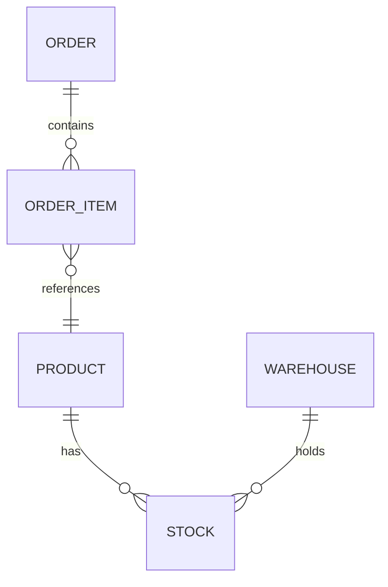

# To-Spec — HICC Data Warehouse Blueprint

Draw the blueprint for a data model before any code is written. This skill takes approved requirements (from `grill` or direct user input) and produces a formal specification document (`spec.md`) for the HICC PET data warehouse.

**Blueprint** is the leading word: the spec is the model's design drawing, reviewed and signed off before construction begins. Every ambiguity resolved here prevents a construction defect downstream.

Output artifact: a single `spec.md` in the repo root or a dedicated specs directory. The spec is the single source of truth for the downstream `to-ticket → implement-hicc-dw` pipeline.

## 1. Business Context & Query Patterns

Before drawing the blueprint, understand who uses the data and how.

1. **Business domain** — which of the 9 HICC domains does this belong to (01_trd / 02_mkt / 03_prd / 04_ful / 05_inv / 06_voc / 07_fnc / 08_scm / 09_mdm)?
2. **Query audience** — who will query this model? (FineBI reports / ad-hoc analysts / operational dashboards / data science)
3. **Query patterns** — what are the top 3 query patterns? (e.g. "daily GMV by channel by country", "monthly avg inventory by warehouse", "SKU-level P&L")
4. **Freshness requirement** — how fresh must the data be? (T+0 real-time / T+1 daily / T+7 weekly / monthly)
5. **Data volume estimate** — approximate row count at current volume and projected 6-month growth. Pull from upstream ods table `INFORMATION_SCHEMA` if available.
6. **Existing models** — check `hicc-dw` `lineage.md` and `architecture.md` for any overlapping models. If the model already exists, this is a **modification spec** — skip to the change log.

**Completion criterion**: business domain, audience, query patterns, and freshness are documented. If the model already exists, confirm with the user whether this is a modification.

## 2. Conceptual Model

Draw the high-level entity relationship. This is the section the business user signs off on.

1. **Entities** — list every business entity involved (Order, Product, Customer, Warehouse, etc.)
2. **Relationships** — describe the cardinalities (Order 1→N OrderItem, Product N→M Warehouse via Stock)
3. **Mermaid ERD** — generate a Mermaid ER diagram for visual review:



4. **Glossary** — define any ambiguous business terms (e.g. "有效订单" = status ≠ CANCELLED, "在库天数" = days since last receipt)

**Completion criterion**: the ERD and glossary are readable by a non-technical stakeholder. If they ask "what does this entity mean?", the blueprint is insufficient — refine it.

## 2.5 Bus Matrix

> The Bus Matrix is **Kimball's most important artifact** for cross-domain consistency. Even for a single-domain spec, fill out the portion relevant to this project — it prevents future conflicts when models span domains.

A Bus Matrix shows **all fact tables × all conformed dimensions**. Each cell marks whether a dimension is used by a fact table.

### Single-Domain Bus Matrix (minimum for this spec)

```yaml
bus_matrix:
  domain: 01_trd   # Replace with the actual domain from Section 1
  facts:
    - name: "{fact_model_name}"
      dimensions:
        order_date:        ✅
        channel:           ✅
        seller:            ✅
        sku:               ✅
        exchange_rate:     ✅
        warehouse:         ❌ (not applicable)
        customer:          ❌ (not applicable for aggregate)
```

### Multi-Domain Bus Matrix (when crossing domains)

When a spec spans multiple domains (e.g. order + inventory + finance), build a consolidated matrix:

```yaml
bus_matrix:
  domains: [01_trd, 05_inv, 07_fnc]
  facts:
    - name: dwd_trd_toc_order_item_di
      dimensions:
        order_date:        ✅
        channel:           ✅
        seller:            ✅
        sku:               ✅
        exchange_rate:     ✅
        warehouse:         ❌
        purchase_order:    ❌
    - name: dwd_inv_global_detail_v2_snap
      dimensions:
        order_date:        ❌ (snapshot, uses synctime)
        channel:           ✅
        seller:            ✅
        sku:               ✅
        exchange_rate:     ❌
        warehouse:         ✅
        purchase_order:    ❌
    - name: dws_fnc_profitability_monthly
      dimensions:
        order_date:        ✅ (month grain)
        channel:           ✅
        seller:            ✅
        sku:               ✅
        exchange_rate:     ✅
        warehouse:         ❌
        purchase_order:    ❌
```

### Key Rules for the Bus Matrix

1. **Conformed dimensions** — same dimension name across different facts must mean the same thing. `channel_id` in `dwd_trd_toc_order_item` and `dwd_inv_global_detail` must reference the same `dim_channel` table.
2. **Date dimension** — every fact has a date/time grain. Always include `order_date` (or equivalent) in the matrix.
3. **Exchange rate dimension** — every monetary fact must join to `dim_exchange_rates`. If a fact has monetary amounts, `exchange_rate` must be ✅.
4. **SKU dimension consistency** — all facts that reference SKU must use the same SKU dimension per the HICC Canonical Patterns (sales → `dim_product_skus_sales`, inventory → `dim_product_skus_warehouse`).

**Completion criterion**: every fact in the spec has a row in the bus matrix and every conformed dimension is marked ✅ or ❌. If any fact is missing a dimension that other same-domain facts have, add it or document the reason. Blueprint the bus matrix before building cross-domain models.

## 3. Grain Declaration

Every model in the blueprint must declare its grain in exactly one sentence. If you can't write one sentence, the model is under-defined.

List every model in the spec with its grain:

```yaml
models:
  - name: dwd_trd_toc_order_item_di
    grain: "one row per order_id × line_item_id"
    layer: dwd
    domain: 01_trd
    type: transaction_fact

  - name: dim_product_skus_sales
    grain: "one row per sku_id"
    layer: dim
    domain: 09_mdm
    type: dimension
```

**Completion criterion**: every model in the spec has a one-sentence grain, layer, and domain. No model passes without a grain that matches its model type (fact/dim/aggregate/snapshot).

## 4. Dimensional Model

For each model declared in Section 3, document the dimensional structure.

### 4.1 Facts (for dwd/dws models)

```yaml
dwd_trd_toc_order_item_di:
  measures:
    - name: unit_price_usd
      data_type: DECIMAL(18,4)
      description: "单价，按汇率转为USD"
    - name: quantity
      data_type: INT64
      description: "数量"
  foreign_keys:
    - name: order_id
      references: dim_orders
      description: "订单维度"
    - name: sku_id
      references: dim_product_skus_sales
      description: "商品维度"
    - name: channel_id
      references: dim_channel
      description: "渠道维度"
```

### 4.2 Dimensions (for dim models)

```yaml
dim_product_skus_sales:
  primary_key: sku_id
  scd_strategy: SCD2
  scd_columns: [category_l1, category_l2, category_l3, brand, supplier]
  attributes:
    - name: sku_code
      data_type: STRING
      description: "SKU编码"
    - name: product_name
      data_type: STRING
      description: "商品名称"
    - name: category_l1
      data_type: STRING
      description: "一级类目"
    - name: category_l2
      data_type: STRING
      description: "二级类目"
    - name: brand
      data_type: STRING
      description: "品牌"
```

### 4.3 Hierarchies

Document any drill path:

```yaml
hierarchies:
  - name: channel_geo
    levels: [channel_id, country_code, marketplace_id]
    description: "渠道 → 国家 → 站点"
```

### 4.4 SCD Strategy Declaration

Selecting the right SCD strategy is a **decision**, not a default. Use this decision tree:

```
需要追踪属性变化的历史吗？
├─ NO  →  SCD1 (overwrite)
│        适用: 纠错型变更（如 typo fix）、内部标识更新
│        实现: UPSERT on matching business key
│
└─ YES → 需要如何查询历史？
     ├─ "查询历史事实时必须按属性当时的原值重算" → SCD2 (add row)
     │   适用: 类目重组、供应商变更、汇率调整
     │   实现: Add new row with effective_date/expiration_date/is_current
     │
     ├─ "只需知道当前值和上一次值" → SCD3 (add column)
     │   适用: 少数属性的简单跟踪（如合同价格）
     │   实现: Add previous_value column (rare, prefer SCD2)
     │
     └─ "属性值从未改变，或由业务决定不追踪" → Fixed (直通)
         适用: 产品品牌（极少变化）、主数据人工标记为不追踪
         实现: Direct pass-through, no SCD metadata columns
```

**HICC convention**:
- 客户面向维度（商品、供应商、渠道）默认 **SCD2**
- 内部参考维度（汇率、类目对照）默认 **SCD1**（覆盖不需要的历史）
- 小表维度（<10K 行）即使只用 SCD1 也建议额外加 `_snap` 快照表，以备历史追溯

### 4.4a Surrogate Key Strategy

> Kimball 方法论的核心要求：维度表使用**无业务含义的自增代理键**，事实表引用代理键而非业务自然键。这确保业务键变化时事实表数据不受影响。

**何时必须使用代理键**：
- SCD2 维度（必须用代理键，因为同一个业务键有多个版本）
- 跨域 JOIN（不同域的自然键可能冲突，如 Amazon 的 SKU 和 Walmart 的 SKU）
- 事实表引用标识长度 > 20 字符（用 INT64 代理键比 STRING JOIN 更快）

**何时可以不用代理键**：
- 小维度（<100 行，如 `dim_channel` 只有 5 行）
- 固定维度（属性永不变化，如 `dim_date`）
- DWS 汇总层（维度从事实表拆出来的退化维度）

**代理键生成规则**：

| 场景 | 生成方式 | 示例 |
|------|---------|------|
| SCD1 维度 | `FARM_FINGERPRINT(CONCAT(source, '_', business_key))` | SHA256 哈希转为 INT64 |
| SCD2 维度 | `FARM_FINGERPRINT(CONCAT(source, '_', business_key, '_', effect_date))` | 含生效日期确保每版本不同 |
| 手动输入维度 | `ROW_NUMBER() OVER (ORDER BY business_key)` | 固定顺序的自增 |
| 跨表引用 | 统一由上游 `dim_*` 表分发，禁止下游自行生成 | 下游只读不写 |

**DDL 示例（SCD2 维度表）**：

```sql
CREATE OR REPLACE TABLE `hiccpet-481303.dim.dim_product_skus_sales`
(
      sku_sk           INT64       NOT NULL OPTIONS(description='代理键')
    , sku_id           STRING      NOT NULL OPTIONS(description='SKU编码（业务键）')
    , product_name     STRING           OPTIONS(description='商品名称')
    , category_l1      STRING           OPTIONS(description='一级类目')
    , category_l2      STRING           OPTIONS(description='二级类目')
    , category_l3      STRING           OPTIONS(description='三级类目')
    , brand            STRING           OPTIONS(description='品牌')
    , effective_date   DATE        NOT NULL OPTIONS(description='版本生效日期（SCD2）')
    , expiration_date  DATE             OPTIONS(description='版本过期日期（SCD2），NULL=当前版本')
    , is_current       BOOLEAN     NOT NULL DEFAULT TRUE OPTIONS(description='是否为当前版本')
    , etl_time         TIMESTAMP   NOT NULL OPTIONS(description='ETL时间（北京时间）')
)
CLUSTER BY sku_id;
```

**Completion criterion**: every dimension declares both SCD strategy AND surrogate key approach. SCD2 dimensions specify `sku_sk` or equivalent surrogate PK. The dimension's physical DDL is unambiguous.

### 4.5 Degenerate Dimension

> A **degenerate dimension** is a dimension that lives in the fact table itself — it has no separate dimension table because it has no attributes beyond its identifier. Common examples: `order_id`, `invoice_no`, `tracking_no`.

Degenerate dimensions are a Kimball pattern for handling identifiers that:
- Have **no descriptive attributes** (no order status, no order type — those go in `dim_orders`)
- Are **needed for drill-through** (from DWS aggregate back to DWD transaction for details)
- Would create **snowflake-like fan-out** if extracted (one `dim_order` per order = 100% of fact rows, no compression benefit)

**How to identify degenerate dimensions**:

```yaml
# In the STM (Section 5), mark each FK with a type:
dwd_trd_toc_order_item_di:
  column_mappings:
    - target: order_id
      source: "ods_orders_00.order_id"
      transformation: direct
      dimension_type: degenerate     # ← Mark: no dim_order table exists
      data_type: STRING
    - target: channel_id
      source: "ods_orders_00.channel_id"
      transformation: direct
      dimension_type: conformed      # ← This goes through dim_channel
      data_type: STRING
    - target: sku_id
      source: "ods_order_items.sku_code → dim_product_skus_sales.sku_id"
      transformation: lookup
      dimension_type: conformed      # ← Goes through dim_product_skus_sales
      data_type: INT64
```

**Rules for degenerate vs conformed dimensions**:

| 特征 | 退化维度 | 一致性维度 |
|------|---------|-----------|
| 独立维度表 | 无，仅事实表中有 ID | 有独立的 `dim_*` 表 |
| JOIN 需求 | 仅 drill-through 用 | 经常用于分析（分组/过滤） |
| 属性 | 无（ID 本身即全部） | 有多个描述性属性列 |
| 跨域复用 | 否 | 是 |
| SCD 需求 | 无 | 有可能是 SCD2 |
| 代理键 | 不需要 | 需要 |

**标注方式**：在 Column Manifest（见 implement 的 Section 3）中，退化维度标注 `[degenerate]` 后缀：

```sql
-- Columns:
--   order_id         ← src_orders.order_id     [degenerate]
--   channel_id       ← src_orders.channel_id   [FK → dim_channel]
--   sku_id           ← src_order_items.sku_code → dim_product_skus_sales.sku_id [FK → dim_product_skus_sales]
```

**Completion criterion**: every FK in every fact table is classified as either `degenerate` or `conformed`. No FK is left unclassified. Blueprint the FK classification before the STM is finalized.

## 5. Source-to-Target Mapping (STM)

This is the column-level blueprint. Every column in every target model maps to an upstream source.

```yaml
dwd_trd_toc_order_item_di:
  column_mappings:
    - target: order_id
      source: "ods_orders_00.order_id"
      transformation: direct
      data_type: STRING
      cleaning: "TRIM, reject NULL"
    - target: unit_price_usd
      source: "ods_order_items.unit_price, dim_exchange_rates.to_usd_rate"
      transformation: "oi.unit_price / COALESCE(er.to_usd_rate, 1)"
      data_type: DECIMAL(18,4)
      cleaning: "flag negative unit_price for review"
    - target: sku_id
      source: "ods_order_items.sku_code → dim_product_skus_sales.sku_id"
      transformation: "JOIN dim_product_skus_sales ON sku_code"
      data_type: INT64
      cleaning: "unmatched → 0 (UNMAPPED), log warning if >5%"
    - target: event_date_utc
      source: "ods_orders_00.event_time"
      transformation: "DATE(event_time_utc)"
      data_type: DATE
      cleaning: "reject NULL event_time"
```

Transformation types:
- `direct` — pass through as-is
- `lookup` — JOIN to a dimension table
- `computed` — arithmetic or function
- `derived` — CASE WHEN / COALESCE / conditional
- `system` — etl_time, row_hash, etc.

**Completion criterion**: every column in every target model has a row in the STM. The `transformation` field is specific enough to generate SQL from (the `implement-hicc-dw` skill will use this directly). Blueprint the column lineage until no analyst reading the STM would ask "where does this field come from?"

## 6. Metric Definitions

Every aggregated metric (in DWS models and FineBI) must have a complete, unambiguous definition.

```yaml
metrics:
  - name: gmv_usd
    expression: "SUM(oi.unit_price_usd * oi.quantity)"
    model: dws_trd_daily_channel_summary
    aggregation: SUM
    time_filter: event_date_utc
    filters:
      - "order_status NOT IN ('CANCELLED', 'REFUNDED')"
      - "channel_type = 'toc'"
    unit: USD
    data_source: dwd_trd_toc_order_item_di

  - name: avg_inventory_days
    expression: "AVG(DATE_DIFF(CURRENT_DATE(), last_receipt_date, DAY))"
    model: dws_inv_daily_warehouse_summary
    aggregation: AVG
    unit: days
    data_source: dwd_inv_global_detail_v2_snap
    business_rule: "exclude SKUs with 0 stock (zero-stock SKUs distort the average)"
```

Each metric definition covers:
- Formula (exact SQL expression)
- Aggregation type
- Filter conditions
- Unit
- Data source model
- Business rules / edge cases

**Completion criterion**: every metric a stakeholder has asked for has a definition with all 6 fields filled. An analyst can reproduce the number from source data using only this definition. Blueprint the metrics before any aggregation code is written.

## 7. Data Quality & Acceptance Criteria

Declare how the model will be validated before it's considered production-ready.

```yaml
data_quality:
  dwd_trd_toc_order_item_di:
    pre_merge:
      - "Row count vs yesterday: |count - count_yesterday| / count_yesterday < 0.30"
      - "NULL rate on key columns (order_item_key, order_id, sku_id) = 0%"
    post_merge:
      - "Referential integrity: sku_id IN dim_product_skus_sales > 95%"
      - "Date range: event_date_utc = yesterday only"
      - "Uniqueness: order_item_key = 100%"
      - "Metric reasonability: AVG(unit_price_usd) BETWEEN 1 AND 10000"

  dws_trd_daily_channel_summary:
    post_merge:
      - "Row count: |this.count - yesterday.count| / yesterday.count < 0.10"
      - "Metric reconciles to source: SUM(gmv) = SUM(dwd_trd_toc_order_item_di.gmv) WHERE same date/channel"
```

For each check, the acceptance threshold is stated as a pass/fail condition.

**Completion criterion**: every model has at least a post-merge row count check and a key-column NULL check. For DWD models, referential integrity to referenced DIMs is declared. For DWS models, reconciliation to source DWD is specified. The blueprint draws the quality gates before the model is built.

## 8. Physical Design

Declare the BigQuery-specific physical characteristics.

```yaml
physical_design:
  dwd_trd_toc_order_item_di:
    partition:
      field: event_date_utc
      type: DATE
      expiration_days: 365
    cluster:
      - channel_id
      - country_code
      - sku_id
    materialization: table
    incremental_strategy: null (full refresh)

  dwd_inv_global_detail_v2_snap:
    partition:
      field: synctime
      type: DATE
      expiration_days: 365
    cluster:
      - warehouse_code
      - sku_id
    materialization: table
    incremental_strategy: insert_overwrite

  dws_trd_daily_channel_summary:
    partition:
      field: event_date_utc
      type: DATE
      expiration_days: 730
    cluster:
      - channel_id
      - country_code
    materialization: table
    incremental_strategy: null (full refresh, daily)
```

Key rules:
- **Partition**: always on a date/timestamp column. Prefer `_utc` suffixed timestamps.
- **Cluster**: order by cardinality descending. First column = highest cardinality filter.
- **Materialization**: default `table`; `_snap` suffix → `incremental` + `insert_overwrite`; DWS → `table` or `view`.
- **Expiration**: DIM/DWD = 365 days, DWS = 730 days (historical aggregates kept longer).
- **Business fields**: always allow NULL (`INT64`, not `INT64 NOT NULL`).

**Completion criterion**: every model has partition, cluster, materialization, and expiration declared. The design aligns with HICC's BigQuery cost governance rules (avoid full-table scans, prefer clustered partition pruning).

## 9. Delivery Checklist

Before the spec is complete, run this checklist:

```markdown
## Spec Acceptance Checklist

- [ ] Business domain and audience are documented
- [ ] Conceptual model ERD matches business understanding
- [ ] Every model has a one-sentence grain
- [ ] Bus Matrix is drawn for cross-domain consistency (Section 2.5)
- [ ] Every fact has its measures and foreign keys listed
- [ ] Every foreign key is classified as `degenerate` or `conformed` (Section 4.5)
- [ ] Every dimension has its primary key, attributes, SCD strategy, and **surrogate key approach** (Section 4.4)
- [ ] Every column in every model has a source-to-target mapping
- [ ] Every metric has a complete definition (formula, agg, filter, unit, source)
- [ ] Every model has DQ acceptance criteria
- [ ] Every model has physical design declared
- [ ] No ambiguous business terms — all defined in glossary
- [ ] Schema traps (fan/chasm) are checked in implement Step 0 (no unresolved anti-patterns)
- [ ] The spec does not contradict HICC's existing architecture (`hicc-dw`)
```

**Completion criterion**: every checklist item is checked and verified. If the spec is a modification of an existing model, every changed field is explicitly annotated with `[CHANGED]`. Blueprint until the checklist passes without exception.

## Reference Disclosure

When encountering ambiguous domain-specific knowledge, pull from:

- `hicc-dw` skill (`references/architecture.md`, `cleaning-*.md`, `lineage.md`, `finebi.md`) — authoritative model registry, cleaning rules, existing metric definitions, and dependency graph
- `implement-hicc-dw` skill — the downstream consumer of this spec; ensure the spec generates sufficient input for the implement skill's 7 steps
- The `spec.md` file produced by this skill is the handoff artifact to `to-ticket` and `implement-hicc-dw`