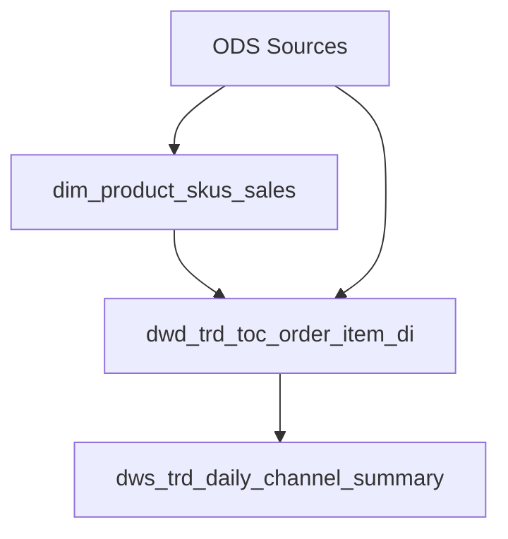

# To-Ticket — HICC Data Warehouse Scaffold

Build the scaffolding that turns a spec into ordered, parallelizable work items. This skill takes the `spec.md` (from `to-spec-hicc-dw`) and produces `tickets.md`: a task graph of implementable tickets respecting dbt topological order, with clear ownership, acceptance criteria, and blocking dependencies.

**Scaffold** is the leading word: the spec is the blueprint, tickets are the scaffolding that lets multiple builders work in parallel without colliding. Every ticket has a clear boundary, a clear output, and a clear dependency — nothing left implicit.

Output artifact: `tickets.md` in the same directory as the spec. All tickets in a single markdown file, grouped by tier, with dependency IDs linking them. Each ticket has a unique ID (`TICKET-001`), type, description, acceptance criteria, and dependency list.

## 1. Spec Scan

Read the `spec.md` and inventory what needs to be built.

1. **Count models** — list every model declared in Section 3 (Grain Declaration)
2. **Categorize by layer** — split into DIM / DWD / DWS
3. **Map dependencies** — reference spec Section 4 (Dimensional Model) for foreign key dependencies:
   - DIM models depend on ODS sources only
   - DWD models depend on referenced DIMs + ODS sources
   - DWS models depend on upstream DWD models
   - Models that `{{ ref() }}` another dbt model block on that model's DM ticket
4. **Count metrics** — every metric in Section 6 gets a validation ticket
5. **Branch: greenfield vs modification**:
   - **Greenfield** (all models in spec are new): generate DDL + DM + VAL per model
   - **Modification** (spec changes existing model logic): generate DM + BACKFILL + VAL per changed model, skip DDL entirely
   - If mixed, treat each model independently per its own status

```yaml
# Example inventory output
models_to_build:
  - model: dim_product_skus_sales
    layer: dim
    dependencies: [ods_03_prd_product_skus]
  - model: dwd_trd_toc_order_item_di
    layer: dwd
    dependencies: [dim_product_skus_sales, ods_01_trd_orders, ods_01_trd_order_items]
  - model: dws_trd_daily_channel_summary
    layer: dws
    dependencies: [dwd_trd_toc_order_item_di]

metrics_to_validate:
  - gmv_usd
  - avg_order_value

modifications: []  # empty for greenfield
```

**Completion criterion**: every model in the spec appears in the inventory. Every dependency is traced. Dependencies that cross spec boundaries (e.g. referencing a model NOT built in this spec) are noted as external assumptions. Scaffold stops here until the inventory is complete.

## 2. Dependency DAG

Convert the inventory into a directed acyclic graph. Draw the DAG explicitly:



Sort the DAG topologically — this determines ticket execution order:

```
Tier 1 (no dependencies): dim_product_skus_sales
Tier 2 (depends on Tier 1): dwd_trd_toc_order_item_di
Tier 3 (depends on Tier 2): dws_trd_daily_channel_summary
```

Within the same tier, tickets can be parallelized. Between tiers, tickets block.

**Completion criterion**: the DAG is acyclic and topologically sorted. Every model's dependencies match the dbt `{{ ref() }}` calls it will contain. If there's a cycle, flag it — the spec needs revision. Scaffold the DAG until all tiers are clean.

## 3. Ticket Generation

For each model and validation, generate one or more tickets with the appropriate template.

### 3.1 Ticket ID Scheme

```
TICKET-{NNN}: {Type} — {model_name}
```

Types: `DDL` / `DM` (dbt SQL + schema.yml) / `VAL` (validation) / `BACKFILL` / `REVIEW` (cross-layer reconciliation)

### 3.2 Ticket Templates

**DDL Ticket** — for new tables only (skip for modifications):

```markdown
## TICKET-001: DDL — dim_product_skus_sales

**Layer**: dim | **Domain**: 09_mdm | **Priority**: P0 (blocking)

**Description**: Create the BigQuery table for dim_product_skus_sales.

**Dependencies**: None

**Acceptance Criteria**:
- [ ] Table exists in `hiccpet-481303.dim.product_skus_sales`
- [ ] Partition: none (dimension tables are not date-partitioned)
- [ ] Cluster: none, or sku_id (if large SCD2 dimension >1M rows)
- [ ] Schema matches spec Section 4.2
- [ ] Business fields allow NULL
```

**Data Model Ticket** — dbt SQL + schema.yml:

```markdown
## TICKET-002: DM — dim_product_skus_sales

**Layer**: dim | **Domain**: 09_mdm | **Priority**: P0

**Description**: Write the dbt model SQL for dim_product_skus_sales per spec Section 4.2.

**Spec Reference**: spec.md → Sections 3, 4.2, 5 (STM), 8 (Physical)

**Dependencies**: TICKET-001 (DDL)

**Acceptance Criteria**:
- [ ] Model SQL follows `implement-hicc-dw` conventions (comma-first, 1=1, grain comment)
- [ ] All columns from STM (spec Section 5) are included
- [ ] Source mappings use `{{ source() }}` / `{{ ref() }}`, never hardcoded table names
- [ ] `schema.yml` has unique + not_null on primary key
- [ ] `schema.yml` has not_null on every attribute
- [ ] `dbt compile` passes without errors
```

**Validation Ticket** — run DQ checks:

```markdown
## TICKET-003: VAL — dim_product_skus_sales

**Layer**: dim | **Domain**: 09_mdm | **Priority**: P1

**Description**: Validate dim_product_skus_sales against spec Section 7 criteria.

**Dependencies**: TICKET-002 (DM)

**Acceptance Criteria** (from spec DQ):
- [ ] Uniqueness: sku_id = 100%
- [ ] Null rate: every column < 1%
- [ ] Row count: within expected range from upstream ODS
- [ ] Referential integrity: N/A (this is a root DIM)
```

**Backfill Ticket** — for logic changes on existing models:

```markdown
## TICKET-004: BACKFILL — dwd_trd_toc_order_item_di

**Layer**: dwd | **Domain**: 01_trd | **Priority**: P1

**Description**: Backfill historical data for changed logic.
**Window**: 30 days before change date to today.

**Rollback**: git checkout previous version → `dbt run --select dwd_trd_toc_order_item_di`

**Dependencies**: TICKET-NNN (DM change)

**Acceptance Criteria**:
- [ ] Row count after backfill matches expected volume
- [ ] Reconciliation: compare 1-day overlap between old and new logic
- [ ] No new NULLs introduced on key columns
```

**Review Ticket** — cross-model verification:

```markdown
## TICKET-005: REVIEW — DWS → DWD reconciliation

**Layer**: cross-layer | **Priority**: P1

**Description**: Verify dws_trd_daily_channel_summary reconciles to its source DWD.

**Dependencies**: TICKET-NNN (DWS DM), TICKET-NNN (DWD VAL)

**Acceptance Criteria**:
- [ ] SUM(gmv) for each date/channel in DWS = SUM(gmv) for same date/channel in DWD (within $0.01 tolerance)
- [ ] Row count matches between DWS and DWD's distinct grain (channel × date)
```

**Completion criterion**: every model in the inventory has at least a DM ticket and a VAL ticket. Cross-layer dependencies are expressed as REVIEW tickets. Each ticket has explicit acceptance criteria derived from the spec's DQ section. Scaffold the tickets until every implementable unit of work has its own ticket.

## 4. Ticket DAG Assembly

Assemble all tickets into the final dependency graph:

```yaml
ticket_dag:
  tier_1:
    - TICKET-001: DDL — dim_product_skus_sales
    - TICKET-002: DM — dim_product_skus_sales
    - TICKET-003: VAL — dim_product_skus_sales
  tier_2:
    - TICKET-004: DDL — dwd_trd_toc_order_item_di
    - TICKET-005: DM — dwd_trd_toc_order_item_di
    - TICKET-006: VAL — dwd_trd_toc_order_item_di
  tier_3:
    - TICKET-007: DM — dws_trd_daily_channel_summary
    - TICKET-008: VAL — dws_trd_daily_channel_summary
    - TICKET-009: REVIEW — DWS ↔ DWD reconciliation
```

Within a tier, tickets can be parallelized. Tiers block sequentially.

Note which tickets can run in parallel vs need to block:

| Parallelizable (same tier) | Blocking (across tiers / within model) |
|---------------|----------|
| DM tickets across different models | Tier N+1 blocks on all Tier N tickets |
| VAL tickets across different models | DM blocks on DDL (same model) |
|  | VAL blocks on DM (same model) |
|  | Backfill blocks on DM (same model, modification) |
|  | REVIEW blocks on all referenced VALs |

Within the same model, tickets are sequential: DDL → DM → VAL. Across models in the same tier, DM/VAL tickets can be parallelized.

**Completion criterion**: the DAG has no cycles, respects dbt topological order (DIM→DWD→DWS), and tier 1 dependencies are complete before tier 2 begins. Scaffold the DAG until it's execution-ready.

## 5. Timeline & Execution Plan

Summarize the execution plan:

```markdown
## Execution Plan

**Total tickets**: 9
**Estimated dbt models**: 3

**Phase 1 (Tier 1 — DIM)**:
  - 3 tickets, parallelizable
  - Est. effort: ~1 session

**Phase 2 (Tier 2 — DWD)**:
  - 3 tickets, blocks on Phase 1
  - Est. effort: ~1-2 sessions

**Phase 3 (Tier 3 — DWS + Review)**:
  - 3 tickets, blocks on Phase 2
  - Est. effort: ~1 session

**Total est. effort**: 3-4 sessions
**Parallel concurrency**: up to 3 implementer agents (one per tier-1 ticket)
```

**Completion criterion**: the execution plan lists phases, ticket counts, and estimated effort. The plan is ready for the implement-hicc-dw skill to consume. Scaffold the timeline until phases are executable without ambiguity.

## 6. Delivery Checklist

Before the tickets are complete:

```markdown
## Ticket Checklist

- [ ] Every model in the spec has at least a DM ticket and a VAL ticket
- [ ] Every DDL ticket has partition, cluster, and expiration declared
- [ ] Every DM ticket references the spec sections it implements
- [ ] Every VAL ticket derives its acceptance criteria from spec DQ section
- [ ] Dependencies form a valid DAG (acyclic, topological)
- [ ] REVIEW tickets exist for every DWS→DWD cross-layer handoff
- [ ] Greenfield models have DDL tickets; modifications have BACKFILL tickets instead (not both)
- [ ] Ticket IDs are unique and referenced in dependency lists
- [ ] Acceptance criteria are testable (binary pass/fail, no "reasonable" or "as expected")
- [ ] Output is a single `tickets.md` file, grouped by tier
- [ ] No redundant tickets: every ticket maps to a model or validation in the spec
```

**Completion criterion**: every checklist item is checked and verified. Scaffold the tickets until the checklist passes without exception.

## Reference Disclosure

- `spec.md` (from `to-spec-hicc-dw`) — the spec this skill consumes; Sections 3 (model list), 7 (DQ criteria), and 8 (physical design) are the primary inputs for ticket generation
- `implement-hicc-dw` — the downstream consumer of these tickets; each DM ticket feeds into the implement skill's SQL generation steps
- `hicc-dw` references (`lineage.md`, `architecture.md`) — verify model dependencies against the existing warehouse